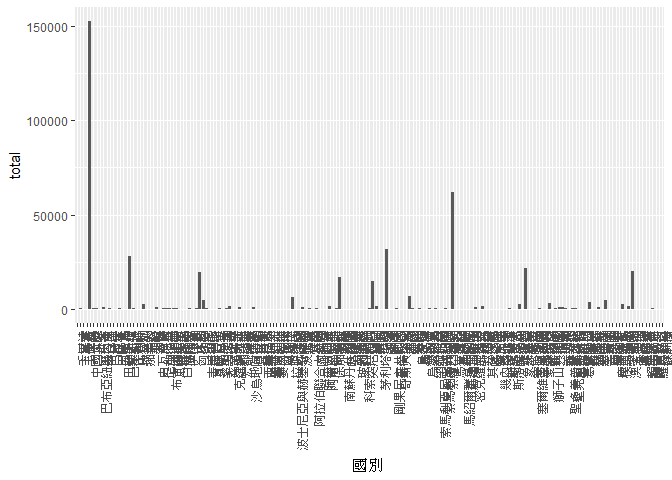
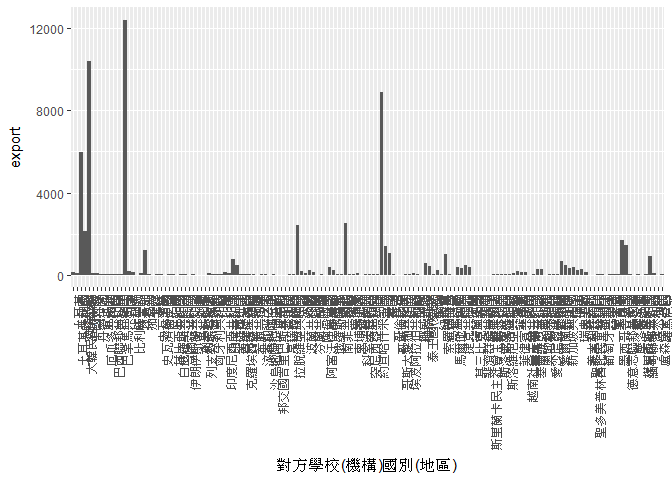

106-2 大數據分析方法 作業二
================
趙于皞

作業完整說明[連結](https://docs.google.com/document/d/1aLGSsGXhgOVgwzSg9JdaNz2qGPQJSoupDAQownkGf_I/edit?usp=sharing)

學習再也不限定在自己出生的國家，台灣每年有許多學生選擇就讀國外的大專院校，同時也有人多國外的學生來台灣就讀，透過分析[大專校院境外學生人數統計](https://data.gov.tw/dataset/6289)、[大專校院本國學生出國進修交流數](https://data.gov.tw/dataset/24730)、[世界各主要國家之我國留學生人數統計表](https://ws.moe.edu.tw/Download.ashx?u=C099358C81D4876CC7586B178A6BD6D5062C39FB76BDE7EC7685C1A3C0846BCDD2B4F4C2FE907C3E7E96F97D24487065577A728C59D4D9A4ECDFF432EA5A114C8B01E4AFECC637696DE4DAECA03BB417&n=4E402A02CE6F0B6C1B3C7E89FDA1FAD0B5DDFA6F3DA74E2DA06AE927F09433CFBC07A1910C169A1845D8EB78BD7D60D7414F74617F2A6B71DC86D17C9DA3781394EF5794EEA7363C&icon=..csv)可以了解103年以後各大專院校國際交流的情形。請同學分析以下議題，並以視覺化的方式呈現分析結果，呈現103年以後大專院校國際交流的情形。

### 安裝package

``` r
library(choroplethr)
```

    ## Warning: package 'choroplethr' was built under R version 3.4.4

    ## Loading required package: acs

    ## Warning: package 'acs' was built under R version 3.4.4

    ## Loading required package: stringr

    ## Warning: package 'stringr' was built under R version 3.4.4

    ## Loading required package: XML

    ## Warning: package 'XML' was built under R version 3.4.4

    ## 
    ## Attaching package: 'acs'

    ## The following object is masked from 'package:base':
    ## 
    ##     apply

``` r
library(choroplethrMaps)
```

    ## Warning: package 'choroplethrMaps' was built under R version 3.4.4

``` r
library(readxl)
```

    ## Warning: package 'readxl' was built under R version 3.4.4

``` r
library(maps)
```

    ## Warning: package 'maps' was built under R version 3.4.4

``` r
library(readr)
```

    ## Warning: package 'readr' was built under R version 3.4.4

``` r
library(dplyr)
```

    ## 
    ## Attaching package: 'dplyr'

    ## The following object is masked from 'package:acs':
    ## 
    ##     combine

    ## The following objects are masked from 'package:stats':
    ## 
    ##     filter, lag

    ## The following objects are masked from 'package:base':
    ## 
    ##     intersect, setdiff, setequal, union

``` r
library(ggplot2)
```

    ## Warning: package 'ggplot2' was built under R version 3.4.4

``` r
library(jsonlite)
```

    ## Warning: package 'jsonlite' was built under R version 3.4.4

``` r
library(RCurl)
```

    ## Warning: package 'RCurl' was built under R version 3.4.4

    ## Loading required package: bitops

``` r
library(R6)
```

    ## Warning: package 'R6' was built under R version 3.4.4

``` r
library(Hmisc)
```

    ## Warning: package 'Hmisc' was built under R version 3.4.4

    ## Loading required package: lattice

    ## Loading required package: survival

    ## Loading required package: Formula

    ## Warning: package 'Formula' was built under R version 3.4.4

    ## 
    ## Attaching package: 'Hmisc'

    ## The following objects are masked from 'package:dplyr':
    ## 
    ##     src, summarize

    ## The following objects are masked from 'package:base':
    ## 
    ##     format.pval, units

``` r
library(stringr)
library(scales)
```

    ## Warning: package 'scales' was built under R version 3.4.4

    ## 
    ## Attaching package: 'scales'

    ## The following object is masked from 'package:readr':
    ## 
    ##     col_factor

來台境外生分析
--------------

### 資料匯入與處理

``` r
Foreign03C<-read_csv("http://stats.moe.gov.tw/files/detail/103/103_ab103_C.csv")
```

    ## Parsed with column specification:
    ## cols(
    ##   洲別 = col_character(),
    ##   國別 = col_character(),
    ##   `學位生-正式修讀學位外國生` = col_integer(),
    ##   `學位生-僑生(含港澳)` = col_integer(),
    ##   `學位生-正式修讀學位陸生` = col_integer(),
    ##   `非學位生-外國交換生` = col_integer(),
    ##   `非學位生-外國短期研習及個人選讀` = col_integer(),
    ##   `非學位生-大專附設華語文中心學生` = col_integer(),
    ##   `非學位生-大陸研修生` = col_integer(),
    ##   `非學位生-海青班` = col_integer(),
    ##   境外專班 = col_integer()
    ## )

``` r
Foreign03<-read_csv("http://stats.moe.gov.tw/files/detail/103/103_ab103_S.csv")
```

    ## Parsed with column specification:
    ## cols(
    ##   學校類型 = col_character(),
    ##   學校代碼 = col_character(),
    ##   學校名稱 = col_character(),
    ##   `學位生-正式修讀學位外國生` = col_integer(),
    ##   `學位生-僑生(含港澳)` = col_integer(),
    ##   `學位生-正式修讀學位陸生` = col_integer(),
    ##   `非學位生-外國交換生` = col_integer(),
    ##   `非學位生-外國短期研習及個人選讀` = col_integer(),
    ##   `非學位生-大專附設華語文中心學生` = col_integer(),
    ##   `非學位生-大陸研修生` = col_character(),
    ##   `非學位生-海青班` = col_integer(),
    ##   境外專班 = col_integer()
    ## )

``` r
Foreign04C<-read_csv("http://stats.moe.gov.tw/files/detail/104/104_ab104_C.csv")
```

    ## Parsed with column specification:
    ## cols(
    ##   洲別 = col_character(),
    ##   國別 = col_character(),
    ##   `學位生-正式修讀學位外國生` = col_integer(),
    ##   `學位生-僑生(含港澳)` = col_integer(),
    ##   `學位生-正式修讀學位陸生` = col_integer(),
    ##   `非學位生-外國交換生` = col_integer(),
    ##   `非學位生-外國短期研習及個人選讀` = col_integer(),
    ##   `非學位生-大專附設華語文中心學生` = col_integer(),
    ##   `非學位生-大陸研修生` = col_integer(),
    ##   `非學位生-海青班` = col_integer(),
    ##   境外專班 = col_integer()
    ## )

``` r
Foreign04<-read_csv("http://stats.moe.gov.tw/files/detail/104/104_ab104_S.csv")
```

    ## Parsed with column specification:
    ## cols(
    ##   學校類型 = col_character(),
    ##   學校代碼 = col_character(),
    ##   學校名稱 = col_character(),
    ##   `學位生-正式修讀學位外國生` = col_integer(),
    ##   `學位生-僑生(含港澳)` = col_integer(),
    ##   `學位生-正式修讀學位陸生` = col_integer(),
    ##   `非學位生-外國交換生` = col_integer(),
    ##   `非學位生-外國短期研習及個人選讀` = col_integer(),
    ##   `非學位生-大專附設華語文中心學生` = col_integer(),
    ##   `非學位生-大陸研修生` = col_character(),
    ##   `非學位生-海青班` = col_integer(),
    ##   境外專班 = col_integer()
    ## )

``` r
Foreign05C<-read_csv("http://stats.moe.gov.tw/files/detail/105/105_ab105_C.csv")
```

    ## Parsed with column specification:
    ## cols(
    ##   洲別 = col_character(),
    ##   國別 = col_character(),
    ##   學位生_正式修讀學位外國生 = col_integer(),
    ##   `學位生_僑生(含港澳)` = col_integer(),
    ##   學位生_正式修讀學位陸生 = col_integer(),
    ##   非學位生_外國交換生 = col_integer(),
    ##   非學位生_外國短期研習及個人選讀 = col_integer(),
    ##   非學位生_大專附設華語文中心學生 = col_integer(),
    ##   非學位生_大陸研修生 = col_integer(),
    ##   非學位生_海青班 = col_integer(),
    ##   境外專班 = col_integer()
    ## )

``` r
Foreign05<-read_csv("http://stats.moe.gov.tw/files/detail/105/105_ab105_S.csv")
```

    ## Parsed with column specification:
    ## cols(
    ##   學校類型 = col_character(),
    ##   學校代碼 = col_character(),
    ##   學校名稱 = col_character(),
    ##   學位生_正式修讀學位外國生 = col_integer(),
    ##   `學位生_僑生(含港澳)` = col_integer(),
    ##   學位生_正式修讀學位陸生 = col_integer(),
    ##   非學位生_外國交換生 = col_integer(),
    ##   非學位生_外國短期研習及個人選讀 = col_integer(),
    ##   非學位生_大專附設華語文中心學生 = col_integer(),
    ##   非學位生_大陸研修生 = col_integer(),
    ##   非學位生_海青班 = col_integer(),
    ##   境外專班 = col_integer()
    ## )

``` r
Foreign06C<-read_csv("http://stats.moe.gov.tw/files/detail/106/106_ab105_C.csv")
```

    ## Parsed with column specification:
    ## cols(
    ##   洲別 = col_character(),
    ##   國別 = col_character(),
    ##   學位生_正式修讀學位外國生 = col_integer(),
    ##   `學位生_僑生(含港澳)` = col_integer(),
    ##   學位生_正式修讀學位陸生 = col_integer(),
    ##   非學位生_外國交換生 = col_integer(),
    ##   非學位生_外國短期研習及個人選讀 = col_integer(),
    ##   非學位生_大專附設華語文中心學生 = col_integer(),
    ##   非學位生_大陸研修生 = col_integer(),
    ##   非學位生_海青班 = col_integer(),
    ##   境外專班 = col_integer()
    ## )

``` r
Foreign06<-read_csv("http://stats.moe.gov.tw/files/detail/106/106_ab105_S.csv")
```

    ## Parsed with column specification:
    ## cols(
    ##   學校類型 = col_character(),
    ##   學校代碼 = col_character(),
    ##   學校名稱 = col_character(),
    ##   學位生_正式修讀學位外國生 = col_integer(),
    ##   `學位生_僑生(含港澳)` = col_integer(),
    ##   學位生_正式修讀學位陸生 = col_integer(),
    ##   非學位生_外國交換生 = col_integer(),
    ##   非學位生_外國短期研習及個人選讀 = col_integer(),
    ##   非學位生_大專附設華語文中心學生 = col_integer(),
    ##   非學位生_大陸研修生 = col_integer(),
    ##   非學位生_海青班 = col_integer(),
    ##   境外專班 = col_integer()
    ## )

### 哪些國家來台灣唸書的學生最多呢？

``` r
ForeignC<-merge(Foreign03C,Foreign04C,by="國別",all=T)
ForeignC2<-merge(Foreign05C,Foreign06C,by="國別",all=T)
ForeignC<-merge(ForeignC,ForeignC2,by="國別",all=T)
ForeignC<-ForeignC[,!grepl("洲",ForeignC)]
ForeignC$total<-rowSums(ForeignC[,-1],na.rm = T)
ForeignC[order(ForeignC$total,decreasing = T),c(1,38)]%>%
  head(10)
```

    ##         國別  total
    ## 5   中國大陸 152524
    ## 114 馬來西亞  62031
    ## 94      香港  31940
    ## 17      日本  28200
    ## 136     越南  21670
    ## 168     澳門  20302
    ## 38      印尼  19620
    ## 80      南韓  16948
    ## 90      美國  14846
    ## 101     泰國   7035

### 哪間大學的境外生最多呢？

``` r
ForeignS<-merge(Foreign03[,c(-1,-2)],Foreign04[,c(-1,-2)],by="學校名稱",all=T)
ForeignS2<-merge(Foreign05[,c(-1,-2)],Foreign06[,c(-1,-2)],by="學校名稱",all=T)
ForeignS<-merge(ForeignS,ForeignS2,by="學校名稱",all=T)
for (i in 2:37){
  for (j in 1:165) {
    if (grepl("…",ForeignS[j,i])){
      ForeignS[j,i]<-""
      ForeignS[j,i]<-as.numeric(ForeignS[j,i])
    }else{
      ForeignS[j,i]<-as.numeric(ForeignS[j,i])
    }
  }
}
ForeignS<-ForeignS[,c(-8,-17)]
ForeignS$total<-rowSums(ForeignS[,-1],na.rm = T)
ForeignS[order(ForeignS$total,decreasing = T),c(1,36)]%>%
  head(10)
```

    ##             學校名稱 total
    ## 130     無法區分校別 58472
    ## 111 國立臺灣師範大學 22113
    ## 108     國立臺灣大學 18199
    ## 12      中國文化大學 16074
    ## 153         銘傳大學 16057
    ## 126         淡江大學 13887
    ## 81      國立政治大學 11626
    ## 74      國立成功大學 10982
    ## 150         輔仁大學  9499
    ## 127         逢甲大學  9474

### 各個國家來台灣唸書的學生人數條狀圖

``` r
ggplot(data=ForeignC)+geom_bar(aes(x=國別,y=total),stat = "identity")+
  theme(axis.text.x = element_text(angle = 90, hjust = 1))
```



### 各個國家來台灣唸書的學生人數面量圖

``` r
#這是R Code Chunk
```

台灣學生國際交流分析
--------------------

### 資料匯入與處理

``` r
Exchange<-read_excel("C:/Users/皞皞兒/Desktop/Student_RPT_072.xlsx")
```

### 台灣大專院校的學生最喜歡去哪些國家進修交流呢？

``` r
groupE<-group_by(Exchange,`對方學校(機構)國別(地區)`)%>%
  summarise(export=sum(小計))%>%
  arrange(desc(export))
```

    ## Warning: package 'bindrcpp' was built under R version 3.4.4

``` r
head(groupE,10)
```

    ## # A tibble: 10 x 2
    ##    `對方學校(機構)國別(地區)` export
    ##    <chr>                       <dbl>
    ##  1 日本                       12430.
    ##  2 中國大陸                   10429.
    ##  3 美國                        8916.
    ##  4 大陸地區                    5996.
    ##  5 南韓                        2498.
    ##  6 法國                        2415.
    ##  7 大韓民國(南韓)              2131.
    ##  8 德國                        1706.
    ##  9 德意志聯邦共和國            1458.
    ## 10 英國                        1416.

### 哪間大學的出國交流學生數最多呢？

``` r
groupS<-group_by(Exchange,學校名稱)%>%
  summarise(total=sum(小計))%>%
  arrange(desc(total))
  head(groupS,10)
```

    ## # A tibble: 10 x 2
    ##    學校名稱     total
    ##    <chr>        <dbl>
    ##  1 國立臺灣大學 4719.
    ##  2 淡江大學     3794.
    ##  3 國立政治大學 3479.
    ##  4 逢甲大學     2646.
    ##  5 東海大學     1881.
    ##  6 元智大學     1864.
    ##  7 國立交通大學 1513.
    ##  8 東吳大學     1457.
    ##  9 國立成功大學 1397.
    ## 10 國立臺北大學 1397.

### 台灣大專院校的學生最喜歡去哪些國家進修交流條狀圖

``` r
ggplot(data=groupE)+geom_bar(aes(x=`對方學校(機構)國別(地區)`,y=export),stat = "identity")+
  theme(axis.text.x = element_text(angle = 90, hjust = 1))
```



### 台灣大專院校的學生最喜歡去哪些國家進修交流面量圖

``` r
#這是R Code Chunk
```

台灣學生出國留學分析
--------------------

### 資料匯入與處理

``` r
Studyaboard<-read_csv("https://ws.moe.edu.tw/Download.ashx?u=C099358C81D4876CC7586B178A6BD6D5062C39FB76BDE7EC7685C1A3C0846BCDD2B4F4C2FE907C3E7E96F97D24487065577A728C59D4D9A4ECDFF432EA5A114C8B01E4AFECC637696DE4DAECA03BB417&n=4E402A02CE6F0B6C1B3C7E89FDA1FAD0B5DDFA6F3DA74E2DA06AE927F09433CFBC07A1910C169A1845D8EB78BD7D60D7414F74617F2A6B71DC86D17C9DA3781394EF5794EEA7363C&icon=..csv")
```

    ## Warning: Missing column names filled in: 'X4' [4], 'X5' [5], 'X6' [6]

    ## Parsed with column specification:
    ## cols(
    ##   洲別 = col_character(),
    ##   國別 = col_character(),
    ##   總人數 = col_number(),
    ##   X4 = col_character(),
    ##   X5 = col_character(),
    ##   X6 = col_character()
    ## )

### 台灣學生最喜歡去哪些國家留學呢？

``` r
Oh_Wow<-Studyaboard[,c(1:3)]%>%
  arrange(desc(總人數))
  head(Oh_Wow,10)
```

    ## # A tibble: 10 x 3
    ##    洲別   國別     總人數
    ##    <chr>  <chr>     <dbl>
    ##  1 美洲   美國     21127.
    ##  2 大洋洲 澳大利亞 13582.
    ##  3 亞洲   日本      8444.
    ##  4 美洲   加拿大    4827.
    ##  5 歐洲   英國      3815.
    ##  6 歐洲   德國      1488.
    ##  7 大洋洲 紐西蘭    1106.
    ##  8 歐洲   波蘭       561.
    ##  9 亞洲   馬來西亞   502.
    ## 10 歐洲   奧地利     419.

### 台灣學生最喜歡去哪些國家留學面量圖

``` r
#這是R Code Chunk
```

綜合分析
--------

請問來台讀書與離台讀書的來源國與留學國趨勢是否相同(5分)？想來台灣唸書的境外生，他們的母國也有很多台籍生嗎？請圖文並茂說明你的觀察(10分)。
